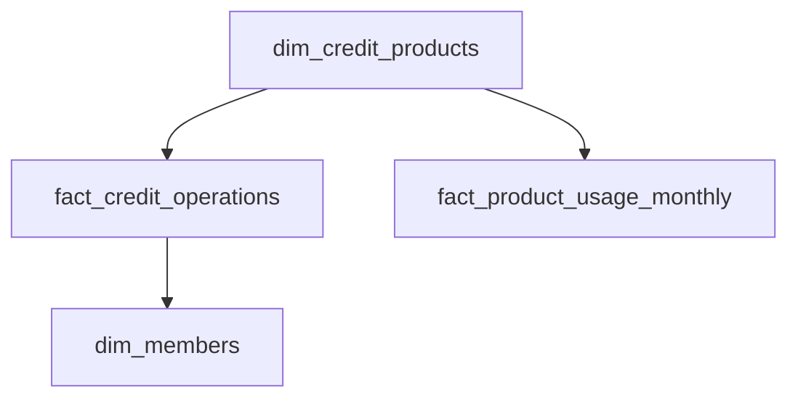

# K-Means Credit-Default Clustering Project

This repository contains an end-to-end data platform simulating a real-life financial institution scenario for data leadership and credit management boards. 

The objective is to cluster credit customers utilizing raw operational, transactional, and relational financial data to derive actionable risk-mitigation, commercial diversification, and capital management strategies.

The solution contains: 
- Data Engineering (Data Modeling, DDL, View definitions, Synthetic Generation, Ingestion)
- K-Means Clustering 
- Data Analysis/Business Intelligence (Cluster Profiling, Concentration Metrics, and Diagnostic Visualizations).

## Language Options
* [English Version](#english-version)
* [Versão em Português](#versão-em-português)
  
 
 
 
 
 
 

# English Version

## Data Architecture & Modeling
The schema is built on a Star/Snowflake hybrid architecture optimized for analytical processing (OLAP) within the Data Warehouse kmeans schema, integrating risk metrics, operational friction, and customer credit exposure.

### 1. Dimension Tables
* **`dim_members`**: High-level entity tracking registration dates, segment types (`Individual`, `Corporate`), internal risk ratings, and Central Bank metrics.
* **`dim_credit_products`**: Product master directory mapping internal capital and funding costs for 7 complex portfolio lines (e.g., Personal Loans, Overdrafts, Agribusiness lines).

### 2. Fact Tables
* **`fact_credit_operations`**: Granular loan-level registry containing active balances, operational TAT (Turn-Around-Time), acquisition costs (CAC), delays, and credit loss provisions (PECL).
* **`fact_product_usage_monthly`**: Historical monthly snapshots monitoring limits, credit utilization boundaries, and transactional payment delays.

### 3. Analytical Engineering & Feature Extraction
The analytical layer was built via a Data Warehouse View (`kmeans.dm_clustering_credit_users`). This layer abstracts the relational complexity utilizing customized RFV (Recency, Frequency, Value) metrics engineered specifically for credit portfolios:

-  Value Metric = Total Exposure (Outstanding Balance)
-  Frequency Metric = Active Products Count (Cross-Sell Dimension) 
- Recency Metric = Vintage Years (Customer Tenure)

 ## Development and process
The analytical process is fully executed through a modular, reproducible programmatic pipeline:

### Phase 1: Synthetic Data Ingestion (Append Mode)
* Managed via a boolean `GENERATE_NEW_DATA` flag, dynamically pushing batches (e.g., 500 new members) along with correlated transactional histories into the data cluster.
* Enforces PostgreSQL `ON CONFLICT (product_id) DO NOTHING` to protect static dimensions.
* Injects a controlled 2% statistical artificial `NaN` volume into `credit_score_internal` to validate the upstream cleaning integrity.

### Phase 2 & 3: Data Transformation & Analytical Storage
* Pulls fields using aggregations (`SUM`, `AVG`, `COUNT DISTINCT`) over relational tables.
* **Median Imputation:** Handles the injected missing rows in `credit_score_internal` using distribution median statistics.
* **Outlier Mitigation:** Applies Tukey's Method (Q1~Q3) on the highly skewed total_exposure metric. Extreme anomalies are clipped to the upper threshold instead of dropped, preserving real high-value operational footprints.
* Writes cleaned vectors into the physical table `mat_view_cleaned_credit_analytics`.

### Phase 4: Statistical Scaling & Machine Learning Modeling
* **Dimensional Alignment:** Uses `StandardScaler` to bring 8 core multi-scale indicators onto the same mathematical landscape:
  * `credit_score_internal`, `active_products_count`, `total_exposure`, `weighted_avg_interest_rate`, `max_days_past_due`, `expected_loss_rate`, `avg_operational_tat_hours`, `avg_payment_delay_freq`.
* **Hyperparameter Specification:** Configures a `KMeans` algorithm targeting $K=4$ clusters, powered by `init='k-means++'`, a max iteration ceiling of `500`, and an execution initialization count `n_init=10`.
* **Mathematical Validation:** Generates a Silhouette Coefficient  to ensure segment partition stability across the Euclidean multi-dimensional space.

### Phase 5 & 6: Profiling & Executive Business Intelligence
Transforms centroids back into readable marketplace statistics, sorting profiles into actionable strategic groups:
* **Cluster 0: High Yield / High Risk:** Maximize nominal yield but carry heavy credit provisions and NPL volatility.
* **Cluster 1: Core Portfolio / Low Risk:** Stable, high-volume base with minimal probability of default.
* **Cluster 2: Mispriced Assets:** Dangerous profile featuring underpriced risk margins with severe payment delays.
* **Cluster 3: Structured Operations / Controlled Risk:** High marginal efficiency with solid post-delinquency recovery trends.

## Technical Stack
* **Language:** Python, SQL
* **Database Driver / Engine:** SQLAlchemy (`create_engine`), PostgreSQL backend dialect
* **Machine Learning & Stats:** Scikit-Learn (`KMeans`, `StandardScaler`, `silhouette_score`)
* **Data Wrangling:** Pandas, NumPy
* **Visual Diagnostics:** Matplotlib, Seaborn

 
 
 
 
 
 

# Versão em português

## Arquitetura e modelagem de dados
O esquema é construído sobre uma arquitetura híbrida em estrela/floco de neve, otimizada para processamento analítico (OLAP) dentro do esquema kmeans do data warehouse, integrando métricas de risco, atrito operacional e exposição de crédito do cliente.

### 1. Tabelas de dimensão
* **`dim_members`**: Entidade de alto nível que rastreia datas de registro, tipos de segmento (`Pessoa Física`, `Pessoa Jurídica`), classificações internas de risco e métricas do Banco Central.
* **`dim_credit_products`**: Diretório mestre de produtos que mapeia os custos internos de capital e financiamento para 7 linhas de portfólio complexas (por exemplo, Empréstimos Pessoais, Cheques Especial, Linhas de Agronegócio).

### 2. Tabelas de fatos
* **`fact_credit_operations`**: Registro detalhado por empréstimo contendo saldos ativos, tempo de processamento (TAT), custos de aquisição (CAC), atrasos e provisões para perdas de crédito (PECL).
* **`fact_product_usage_monthly`**: Instantâneos mensais históricos que monitoram limites, limites de utilização de crédito e atrasos nos pagamentos das transações.

### 3. Engenharia analítica e extração de características
A camada analítica foi construída por meio de uma visão do data warehouse (`kmeans.dm_clustering_credit_users`). Essa camada simplifica a complexidade relacional utilizando métricas RFV (Recency, Frequency, Value) personalizadas, desenvolvidas especificamente para carteiras de crédito:
-  Métrica de valor = Exposição total (saldo pendente)
-  Métrica de frequência = contagem de produtos ativos (dimensão de vendas cruzadas)
- Métrica de recência = anos de vigência (tempo de relacionamento com o cliente)

## Desenvolvimento e processo
O processo analítico é executado integralmente por meio de um pipeline programático modular e reproduzível:

### Fase 1: Ingestão de dados sintéticos (modo de acréscimo)
* Gerenciado por meio de um sinalizador booleano `GENERATE_NEW_DATA`, que envia dinamicamente lotes (por exemplo, 500 novos membros) juntamente com históricos transacionais correlacionados para o cluster de dados.
* Aplica o PostgreSQL `ON CONFLICT (product_id) DO NOTHING` para proteger dimensões estáticas.
* Injeta um volume artificial controlado de 2% de `NaN` em `credit_score_internal` para validar a integridade da limpeza upstream.

### Fases 2 e 3: Transformação de dados e armazenamento analítico
* Extraia campos utilizando agregações (`SUM`, `AVG`, `COUNT DISTINCT`) em tabelas relacionais.
* **Imputação por mediana:** Trata as linhas ausentes inseridas em `credit_score_internal` utilizando estatísticas de mediana da distribuição.
* **Mitigação de outliers:** Aplica o Método de Tukey (Q1~Q3) à métrica `total_exposure`, que apresenta grande assimetria. Anomalias extremas são limitadas ao limite superior em vez de serem descartadas, preservando os padrões operacionais de alto valor real.
* Grava vetores limpos na tabela física `mat_view_cleaned_credit_analytics`.

### Fase 4: Escalonamento estatístico e modelagem de aprendizado de máquina
* **Alinhamento dimensional:** Utiliza o `StandardScaler` para unificar os 8 principais indicadores multiescala em um único plano matemático:
  * `credit_score_internal`, `active_products_count`, `total_exposure`, `weighted_avg_interest_rate`, `max_days_past_due`, `expected_loss_rate`, `avg_operational_tat_hours`, `avg_payment_delay_freq`.
* **Especificação de hiperparâmetros:** Configura um algoritmo `KMeans` visando $K=4$ clusters, alimentado por `init=‘k-means++’`, um limite máximo de iterações de `500` e uma contagem de inicialização de execução `n_init=10`.
* **Validação matemática:** Gera um coeficiente de silhueta para garantir a estabilidade da partição de segmentos no espaço multidimensional euclidiano.

### Fases 5 e 6: Perfilagem e Inteligência Empresarial Executiva
Transforma os centróides novamente em estatísticas de mercado compreensíveis, classificando os perfis em grupos estratégicos passíveis de ação:
* **Cluster 0: Alto Rendimento / Alto Risco:** Maximiza o rendimento nominal, mas apresenta provisões de crédito elevadas e volatilidade dos créditos inadimplentes.
* **Cluster 1: Carteira Principal / Baixo Risco:** Base estável e de alto volume com probabilidade mínima de inadimplência.
* **Cluster 2: Ativos com Preço Errado:** Perfil perigoso caracterizado por margens de risco subvalorizadas com graves atrasos nos pagamentos.
* **Cluster 3: Operações Estruturadas / Risco Controlado:** Alta eficiência marginal com sólidas tendências de recuperação pós-inadimplência.

## Ferramentas
* **Linguagem:** Python, SQL
* **Driver / Mecanismo de Banco de Dados:** SQLAlchemy (`create_engine`), dialeto de backend PostgreSQL
* **Aprendizado de máquina e estatística:** Scikit-Learn (`KMeans`, `StandardScaler`, `silhouette_score`)
* **Preparação de dados:** Pandas, NumPy
* **Diagnóstico visual:** Matplotlib, Seaborn
