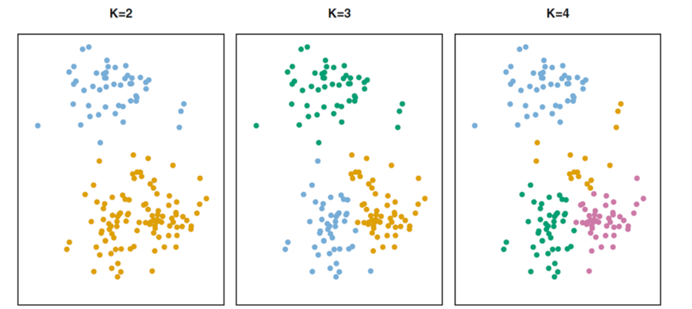
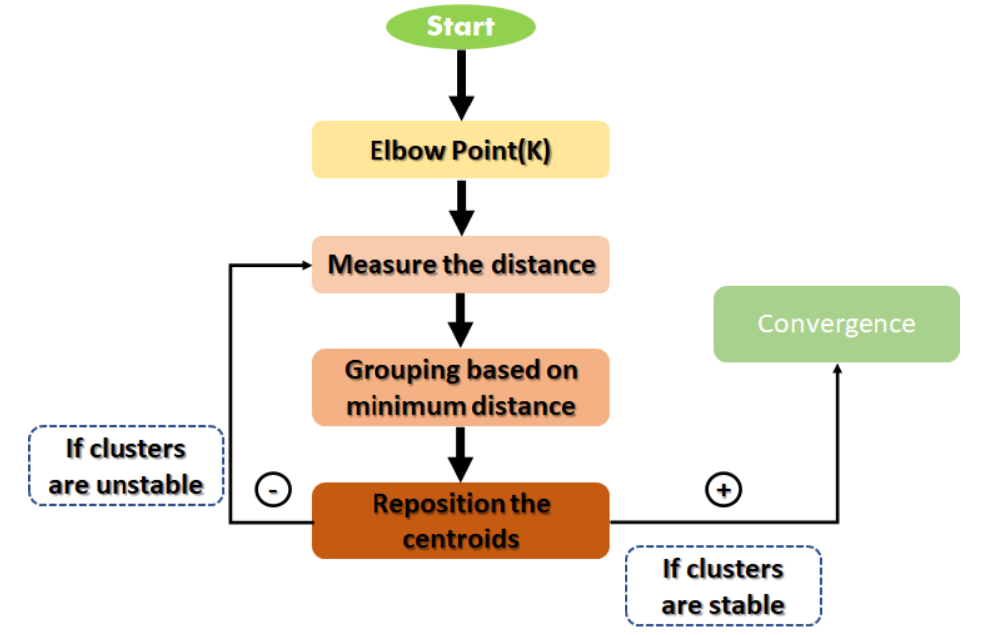

# K-means Clustering Theory

## What is clustering?
Clustering is the task of dividing the population or data points into groups such that data points in the same groups are more similar to other data points in the same group than those in other groups.

## K-means clustering
It's an unsupervised learning algorithm for data clustering, partitioning a data set into K distinct, nonoverlapping clusters. 

It organizes data points into clusters, where each cluster is represented by a centroid. The goal is to minimize the sum of the distances between the data points and their respective centroids, creating groups where the data within a cluster are more similar to each other than to data in other clusters.

## How the Algorithm Works

K-Means follows an iterative process:
- Designation: Specify the desired number of clusters K, in which the algorithm will assign each observation to exactly one of the K clusters.

- Initialization: Randomly selects K initial centroids, where K is the desired number of clusters.
- Assignment: Each data point is assigned to the cluster whose centroid is closest.
- An *Update* will recalculate the centroids as the average of the points assigned to each cluster.
- Iteration: Repeat the assignment and update steps until the cluster centers do not change significantly or a maximum number of iterations is reached.

## Mathematical Framework
### 1. Notation and Set Properties

Let $C_1, C_2, \dots, C_K$ be sets containing the indices of observations assigned to each of the $K$ clusters. These sets form a partition of the dataset, satisfying two strict mathematical properties:

* **Exhaustive Assignment:** Each observation must belong to at least one cluster.

$$\bigcup_{k=1}^K C_k = \{1, \dots, n\}$$

* **Mutually Exclusive:** Clusters are strictly non-overlapping. If the $i$-th observation is assigned to the $k$-th cluster, then $i \in C_k$.

$$C_k \cap C_{k'} = \emptyset \quad \forall k \neq k'$$

### 2. Optimization Objective

The goal of K-means is to minimize the total within-cluster variation across all $K$ clusters:

$$\min_{C_1, \dots, C_K} \sum_{k=1}^K W(C_k)$$

Where $W(C_k)$ represents the variation within cluster $C_k$. The standard metric used is the normalized **pairwise squared Euclidean distance**:

$$W(C_k) = \frac{1}{|C_k|} \sum_{i, i' \in C_k} \sum_{j=1}^p (x_{ij} - x_{i'j})^2$$

Here, $|C_k|$ denotes the number of observations in cluster $k$, and $p$ represents the number of features (dimensions). Combining these yields the complete objective function:

$$\min_{C_1, \dots, C_K} \left[ \sum_{k=1}^K \frac{1}{|C_k|} \sum_{i, i' \in C_k} \sum_{j=1}^p (x_{ij} - x_{i'j})^2 \right]$$

## The K-Means Algorithm

Finding the global minimum is computationally intensive (an NP-hard problem) because there are approximately $K^n$ possible ways to partition $n$ observations into $K$ clusters. Instead, we use a heuristic algorithm that guarantees convergence to a **local optimum**.

**Example**: Even when $K$ is fixed, finding the absolute best ("global") arrangement of $n$ items into those 3 groups mathematically requires checking $K^n$ combinations. If you have just 100 observations and $K=3$, that is $3^{100}$ combinations. Checking every combination is computationally impossible, we stop trying to find the perfect mathematical solution (the global minimum). Instead, we use the step-by-step algorithm to find a good enough solution (a local optimum).

### Step 1: Initialization

Randomly assign a cluster label from $1$ to $K$ to each of the $n$ observations to establish initial assignments.

### Step 2: Iteration

Repeat the following two steps until the cluster assignments stabilize (no changes occur):

1. **Centroid Update:** Compute the mean vector (centroid) $\mu_k$ for each cluster $k$. For each feature $j \in \{1, \dots, p\}$:

$$\mu_{kj} = \frac{1}{|C_k|} \sum_{i \in C_k} x_{ij}$$

2. **Observation Reassignment:** Reassign each observation $i$ to the cluster whose centroid is closest in terms of squared Euclidean distance:

$$\arg\min_{k} \sum_{j=1}^p (x_{ij} - \mu_{kj})^2$$

### The Relationship between the Math and the Algorithm
The math notation and the algorithm are actually two sides of the same coin. The algorithm is just an iterative strategy to minimize the mathematical formula . 

Mathematically, the objective function can be rewritten using the cluster centroids ($\mu_k$):$$\sum_{k=1}^K \frac{1}{|C_k|} \sum_{i, i' \in C_k} \sum_{j=1}^p (x_{ij} - x_{i'j})^2 = 2 \sum_{k=1}^K \sum_{i \in C_k} \sum_{j=1}^p (x_{ij} - \mu_{kj})^2$$The algorithm minimizes this exact formula by alternating between two mathematical steps: 
1. Step 1 (Fix Assignments, Minimize for Centroids): When computing the mean ($\mu_k$), you are finding the exact mathematical point that minimizes the sum of squared distances for that specific group.
2. Step 2 (Fix Centroids, Minimize for Assignments): When reassigning observations to the closest centroid, you are decreasing the total sum of distances across the entire system.

Every single iteration of the algorithm is guaranteed to keep lowering the value of that mathematical objective function until it cannot go any lower.
